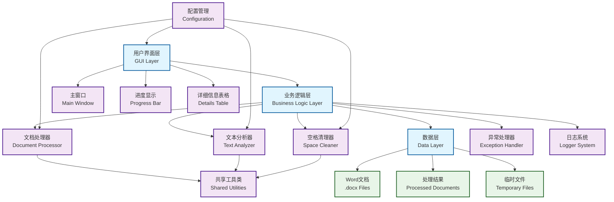

# Word文档中英文空格处理工具

## 项目简介

这是一个用于检测并去除Word文档中英文与中文文本之间多余空格的工具。该工具能够精准识别文档中中文与英文之间的空格，并仅移除这些特定位置的空格，同时严格保留英文单词之间的正常空格。

## 功能特点

- ✅ 精准识别中英文边界
- ✅ 仅去除中英文之间的多余空格
- ✅ 保留英文单词间的正常空格
- ✅ **严格保持文档格式不变** - 字体、字号、颜色、样式等所有格式信息完全保留
- ✅ **保持文档结构完整** - 段落、表格、图片等非文字元素保持不变
- ✅ 用户友好的图形界面
- ✅ 实时文本对比显示
- ✅ 详细的处理统计信息
- ✅ **现代化项目管理** - 使用uv进行依赖管理和环境配置
- ✅ **模块化架构** - 清晰的代码结构和异常处理机制
- ✅ **配置管理** - 统一的配置管理系统
- ✅ **日志系统** - 完整的日志记录和错误追踪

## 技术栈

- **Python 3.12** (项目当前版本)
- **uv** - 现代Python包管理器，比pip快10-100倍
- python-docx: Word文档解析和处理
- PyQt5: 图形用户界面
- pytest: 单元测试框架
- PyInstaller: 应用打包工具
- **项目架构**:
  - 模块化设计，职责分离
  - 完善的异常处理机制
  - 统一的配置管理系统
  - 结构化日志记录

## 安装

### 方法一：使用uv（推荐）

```bash
# 安装uv（如果尚未安装）
pip install uv

# 克隆项目
git clone https://github.com/huminglong/remove_spaces.git
cd remove_spaces

# 安装依赖
uv sync

# 运行程序
uv run python main.py
```

### 方法二：传统方式

```bash
# 创建虚拟环境
python -m venv .venv
source .venv/bin/activate  # Linux/Mac
# 或
.venv\Scripts\activate  # Windows

# 安装依赖
pip install -r requirements.txt

# 运行程序
python main.py
```

## 使用方法

1. **启动程序**：`python main.py`
2. **选择文档**：点击"打开Word文档"按钮选择要处理的Word文档
3. **查看原始内容**：系统自动显示文档的原始文本内容
4. **处理文档**：点击"处理文档"开始清理空格，系统会显示处理进度
5. **查看结果**：处理完成后，右侧会显示处理后的文本对比
6. **保存结果**：点击"保存结果"将处理后的文档保存到新文件

### 使用示例

**处理前**：`这是一个 test 文档 包含 machine learning 机器学习 内容`
**处理后**：`这是一个test文档包含machine learning机器学习内容`

- ✅ 移除了中英文之间的空格：`test → 文档`
- ✅ 移除了中英文之间的空格：`learning → 机器学习`  
- ✅ 保留了英文单词间的空格：`machine learning`

## 项目结构

```text
remove_spaces/
├── main.py                    # 主程序入口
├── pyproject.toml            # 项目配置和依赖管理
├── requirements.txt          # 依赖包列表
├── uv.lock                   # uv锁定文件
├── .gitignore                # Git忽略文件
├── .python-version           # Python版本指定
├── src/                       # 核心源码目录
│   ├── __init__.py
│   ├── document_processor.py  # 文档处理核心模块（保持格式不变）
│   ├── text_analyzer.py       # 文本分析和边界检测模块
│   ├── space_cleaner.py       # 空格清理和处理模块
│   ├── exceptions.py          # 自定义异常类
│   └── logger_config.py       # 日志配置模块
├── config/                    # 配置目录
│   ├── __init__.py
│   └── settings.py            # 项目配置管理
├── gui/                       # 图形界面目录
│   ├── __init__.py
│   └── main_window.py         # 主窗口界面和交互逻辑
├── scripts/                   # 脚本目录
│   ├── build_app.py          # 应用打包脚本
│   └── build.bat             # Windows批处理构建脚本
├── tests/                     # 测试目录
│   ├── __init__.py
│   ├── run_tests.py          # 测试运行脚本
│   └── test_processor.py     # 单元测试
├── processed_documents/       # 处理结果输出目录
├── dist/                      # 打包输出目录
├── doc/                       # 文档目录
├── verify_optimization.py    # 快速验证脚本
├── README.md                  # 项目说明文档
└── 实施文档.md               # 详细技术实施文档
```

## 核心模块详细说明

### 📁 src/ 核心模块

#### `document_processor.py` - 文档处理器

**功能职责**：

- 加载和解析Word文档(.docx格式)
- 提取文档结构信息（段落、表格、文本片段）
- 保持文档格式完整性（字体、颜色、样式等）
- 更新处理后的文本内容到文档中
- 保存处理结果到新文件

**关键方法**：

- `load_document()`: 加载Word文档
- `get_all_text()`: 提取所有可处理文本
- `update_text_content()`: 更新文档文本内容
- `save_document()`: 保存文档到指定路径
- 支持上下文管理器协议

#### `text_analyzer.py` - 文本分析器

**功能职责**：

- 识别中文和英文字符
- 检测中英文边界位置
- 分析文本语言类型分布
- 分割文本为语言片段

**关键方法**：

- `is_chinese_char()`: 判断字符是否为中文
- `is_english_char()`: 判断字符是否为英文
- `find_chinese_english_boundaries()`: 检测中英文边界
- `analyze_text()`: 分析文本统计信息

#### `space_cleaner.py` - 空格清理器

**功能职责**：

- 执行智能空格清理逻辑
- 移除中英文边界处的多余空格
- 保留英文单词间的正常空格
- 提供处理统计信息

**关键方法**：

- `clean_text()`: 清理单个文本的空格
- `clean_multiple_texts()`: 批量处理多个文本
- `get_processing_statistics()`: 获取处理统计数据

#### `exceptions.py` - 异常处理

**功能职责**：

- 定义完整的异常类层次结构
- 提供精确的错误类型和处理机制
- 支持详细的错误追踪和调试

**主要异常类**：

- `DocumentProcessorError`: 文档处理基础异常
- `DocumentLoadError`: 文档加载失败异常
- `DocumentSaveError`: 文档保存失败异常
- `TextCleanerError`: 文本清理异常基类
- `InvalidTextError`: 无效文本异常

#### `logger_config.py` - 日志配置

**功能职责**：

- 统一的日志配置管理
- 支持控制台和文件输出
- 可配置的日志级别和格式

### 📁 config/ 配置模块

#### `settings.py` - 配置管理

**功能职责**：

- 统一管理项目中的各种配置参数
- 避免硬编码，提高可维护性
- 支持窗口、UI、路径、文本分析等多种配置

**配置类别**：

- `Window`: GUI窗口配置
- `UI`: UI组件配置
- `Paths`: 文件路径配置
- `TextAnalysis`: 文本分析相关配置
- `DocumentProcessing`: 文档处理相关配置
- `Logging`: 日志配置

### 🖥️ gui/ 界面模块

#### `main_window.py` - 主窗口界面

**功能职责**：

- 提供用户友好的图形界面
- 处理用户交互（文件选择、处理控制）
- 显示处理进度和结果对比
- 展示详细的处理统计信息

### 🧪 tests/ 测试模块

#### `test_processor.py` - 单元测试

**测试覆盖**：

- 文本分析功能测试
- 空格清理逻辑测试
- 文档处理流程测试
- 边界情况处理测试

#### `run_tests.py` - 测试运行器

**功能职责**：

- 统一的测试运行入口
- 支持多种测试运行模式
- 提供测试结果统计和报告

### 📦 scripts/ 脚本模块

#### `build_app.py` - 应用打包脚本

**功能职责**：

- 使用PyInstaller打包应用为独立可执行文件
- 自动化的构建流程管理
- 支持Windows平台的打包配置

**主要功能**：

- 清理之前的构建文件
- 创建输出目录结构
- 执行打包过程
- 验证构建结果
- 创建使用说明文件

## 详细使用示例

### 基本使用流程

```python
from src.document_processor import DocumentProcessor
from src.space_cleaner import SpaceCleaner

# 1. 初始化处理器
processor = DocumentProcessor()
cleaner = SpaceCleaner()

# 2. 加载文档
if processor.load_document('example.docx'):
    # 3. 获取所有文本内容
    texts = processor.get_all_text()

    # 4. 处理文本
    cleaned_texts = []
    for text in texts:
        result = cleaner.clean_text(text)
        cleaned_texts.append(result['cleaned_text'])

    # 5. 更新文档内容
    processor.update_text_content(cleaned_texts)

    # 6. 保存结果
    processor.save_document('cleaned_example.docx')
```

### 使用上下文管理器

```python
from src.document_processor import DocumentProcessor

# 使用上下文管理器自动处理资源清理
with DocumentProcessor() as processor:
    if processor.load_document('example.docx'):
        # 处理文档
        texts = processor.get_all_text()
        # ... 处理逻辑
        processor.save_document('output.docx')
```

### 命令行使用

```bash
# 启动图形界面
python main.py

# 运行测试
python tests/run_tests.py

# 快速验证优化后的代码
python verify_optimization.py
```

### API使用示例

#### 文本分析

```python
from src.text_analyzer import TextAnalyzer

analyzer = TextAnalyzer()

# 分析文本
text = "这是一个test文本，包含machine learning内容"
result = analyzer.analyze_text(text)

print(f"中文字符数: {result['chinese_chars']}")
print(f"英文字符数: {result['english_chars']}")
print(f"空格数: {result['spaces']}")

# 检测边界
boundaries = analyzer.find_chinese_english_boundaries(text)
print(f"检测到 {len(boundaries)} 个中英文边界")
```

#### 空格清理

```python
from src.space_cleaner import SpaceCleaner

cleaner = SpaceCleaner()

# 清理单个文本
text = "你好 hello world 世界"
result = cleaner.clean_text(text)

print(f"原始文本: {result['original_text']}")
print(f"清理后: {result['cleaned_text']}")
print(f"移除空格数: {result['spaces_removed']}")

# 批量处理
texts = ["你好 hello", "world 世界", "machine learning"]
results = cleaner.clean_multiple_texts(texts)

# 获取统计信息
stats = cleaner.get_processing_statistics(results)
print(f"处理文本总数: {stats['total_texts']}")
print(f"变更率: {stats['change_rate']}%")
```

#### 配置使用

```python
from config.settings import settings

# 访问窗口配置
window_width = settings.Window.WIDTH
window_height = settings.Window.HEIGHT

# 访问文本分析配置
chinese_ranges = settings.TextAnalysis.CHINESE_RANGES

# 访问路径配置
output_dir = settings.Paths.OUTPUT_DIR
```

### 架构图



## 核心特性详解

### 🎯 精准的中英文边界识别

- 使用正则表达式和字符编码检测
- 准确识别中文、英文、数字、标点符号
- 智能判断真正的中英文边界位置
- 支持多Unicode范围的中文和英文字符

### 🔄 格式保持机制

- **零格式丢失**：所有字体、字号、颜色、粗体、斜体、下划线等格式完全保留
- **结构完整性**：段落、表格、页眉页脚等文档结构保持不变
- **非文字元素**：图片、图表、形状等非文字内容完全不受影响

### 📊 详细的处理统计

- 总文本段落数量
- 发生变更的文本数量
- 移除的空格总数
- 变更率百分比
- 每个变更的详细说明

### 🛡️ 完善的异常处理

- 分层的异常类设计
- 精确的错误类型识别
- 详细的错误信息和追踪
- 优雅的错误恢复机制

### 📝 结构化日志系统

- 统一的日志格式和配置
- 多级别日志记录（DEBUG、INFO、WARNING、ERROR）
- 控制台和文件双重输出
- 可配置的日志轮转和备份

## 测试

```bash
# 运行所有测试
python tests/run_tests.py

# 运行pytest测试
pytest tests/test_processor.py -v

# 运行特定测试
pytest tests/test_processor.py::TestTextAnalyzer::test_chinese_char_detection -v

# 快速验证优化后的代码
python verify_optimization.py
```

## 应用打包

### 打包成 Windows 可执行文件 (.exe)

如果你想把本项目打包成独立的 Windows 可执行文件（exe），可以使用 PyInstaller。项目提供了完整的打包脚本：

```bash
# 使用项目提供的打包脚本
python scripts/build_app.py
```

**打包特性**：

- 自动清理之前的构建文件
- 创建完整的目录结构
- 生成独立可执行文件
- 验证构建结果
- 创建使用说明文档
- 清理过程文件，只保留最终输出

**输出结构**：

```
dist/Release/
├── remove_spaces_tool.exe    # 主程序
├── processed_documents/      # 输出目录
└── README.md                 # 使用说明
```

### 手动打包（可选）

```bash
# 安装打包依赖
pip install pyinstaller

# 使用PyInstaller打包
pyinstaller --clean --noconfirm --onefile --windowed main.py
```

## 故障排除

### 常见问题

1. **依赖安装失败**

   ```bash
   # 使用uv重新安装
   uv sync --reinstall
   
   # 或升级pip后重新安装
   python -m pip install --upgrade pip
   pip install -r requirements.txt --force-reinstall
   ```

2. **程序无法启动**
   - 检查Python版本是否为3.12
   - 确认已安装PyQt5：`uv add pyqt5`
   - 在Windows上可能需要安装Microsoft Visual C++ 运行库

3. **文档处理失败**
   - 确认文档是`.docx`格式（不支持`.doc`）
   - 检查文档是否损坏
   - 确认文档没有被其他程序占用

4. **打包失败**
   - 确保虚拟环境已正确激活
   - 检查所有依赖是否已安装
   - 查看打包日志中的错误信息

### 性能优化

项目已进行多项性能优化：

- **文本分析优化**：使用字符编码范围快速判断
- **文档处理优化**：批量处理减少IO操作
- **内存管理优化**：及时释放不需要的对象
- **异常处理优化**：减少不必要的异常捕获开销

## 开发环境

- **Python版本**: 3.12
- **操作系统**: Windows/Linux/MacOS
- **包管理器**: uv (推荐) / pip
- **IDE支持**: PyCharm、VS Code等

## 贡献指南

1. Fork项目
2. 创建特性分支：`git checkout -b feature-name`
3. 提交修改：`git commit -am 'Add some feature'`
4. 推送到分支：`git push origin feature-name`
5. 提交Pull Request

### 代码规范

- 遵循PEP 8编码规范
- 添加适当的类型注解
- 编写完整的文档字符串
- 为新功能添加单元测试
- 保持模块间的低耦合高内聚

## 注意事项

- 仅支持 `.docx` 格式的Word文档
- 处理过程中原文档不会被修改，结果保存到新文件
- 建议在处理重要文档前先进行备份
- 程序会自动在项目目录下创建`processed_documents`文件夹保存处理结果
- 使用uv进行依赖管理可以确保环境的一致性和可重现性

## 更新日志

- **v1.0**: 基础功能实现，支持中英文边界空格清理
- **v2.0**: 重构文档处理器，实现严格的格式保持机制
- **v2.1**: 优化用户界面，添加处理进度显示和详细信息表格
- **v2.2**: 引入模块化架构，完善异常处理机制
- **v2.3**: 添加统一配置管理系统和结构化日志
- **v2.4**: 优化性能，添加快速验证脚本和自动化构建流程

## 许可证

本项目采用 MIT 许可证。详情请参阅 LICENSE 文件。

## 联系方式

如有问题或建议，请通过以下方式联系：

- 提交 Issue：https://github.com/huminglong/remove_spaces/issues
- 邮箱：[项目维护者邮箱]

---

感谢使用 Word文档中英文空格处理工具！如果这个工具对你有帮助，请给项目一个 ⭐ Star！