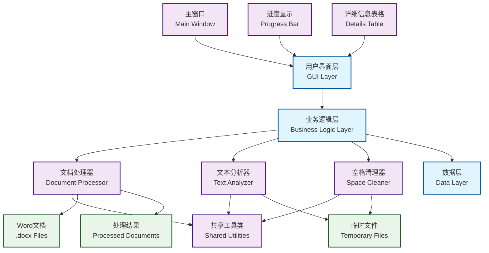
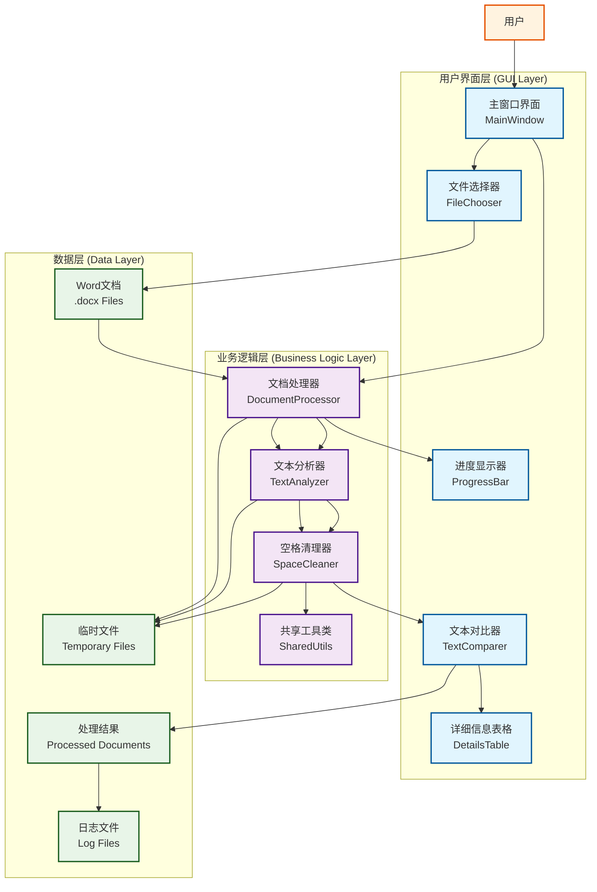
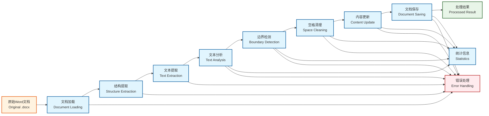

# Word文档中英文空格清理工具实施文档

## 1. 项目概述

### 1.1 项目背景

在日常文档处理中，中英文混排的Word文档经常出现中英文之间多余空格的问题。这些多余空格会影响文档的美观性和专业性。本工具旨在自动识别并清理这些多余空格，同时保持英文单词间的正常空格。

### 1.2 项目目标

- 自动识别Word文档中的中英文边界
- 清理中英文之间的多余空格
- 保持英文单词间的正常空格
- 提供用户友好的图形界面
- 支持批量文档处理

### 1.3 技术栈选择

- **编程语言**: Python 3.11+
- **GUI框架**: PyQt5/PySide2
- **文档处理**: python-docx
- **构建工具**: PyInstaller

## 2. 系统架构设计

### 2.1 整体架构



### 2.2 模块划分

- **GUI模块**: 负责用户界面展示和交互
- **文档处理器**: 负责Word文档的读取和写入
- **文本分析器**: 负责文本内容分析和边界识别
- **空格清理器**: 负责执行具体的空格清理操作

### 2.3 详细模块说明

#### GUI模块 (`gui/main_window.py`)

**核心职责**：

- 提供直观的图形用户界面
- 处理文件选择和拖拽操作
- 显示文档处理进度条
- 实时对比显示原始文本和处理后文本
- 展示详细的处理统计信息和变更表格

**主要组件**：

- 文件选择对话框
- 文本显示区域（原始/处理后对比）
- 进度条和状态显示
- 详细信息表格（显示每个文本段的处理情况）
- 保存功能（自动创建processed_documents文件夹）

#### 文档处理器模块 (`src/document_processor.py`)

**核心职责**：

- 加载和解析Word文档(.docx格式)
- 提取完整的文档结构（段落、表格、文本片段）
- 保持所有格式信息（字体、颜色、样式、run信息）
- 智能更新文本内容而不破坏格式
- 支持保存为新文档

**关键功能**：

- `load_document()`: 使用python-docx加载文档，提取结构
- `_extract_document_structure()`: 深度解析文档结构
- `_extract_runs()`: 提取文本片段的格式信息
- `update_text_content()`: 保持格式更新文本内容
- `save_as_new_document()`: 保存处理结果

#### 文本分析器模块 (`src/text_analyzer.py`)

**核心职责**：

- 基于Unicode范围识别中文和英文字符
- 检测中英文转换边界位置
- 分析文本的语言分布统计
- 分割文本为连续的语言片段

**核心算法**：

- Unicode字符范围检测（中文：4E00-9FFF等，英文：41-5A,61-7A等）
- 边界检测算法：扫描相邻字符的语言类型变化
- 文本分段算法：按语言类型连续性分割文本

**关键方法**：

- `is_chinese_char()` / `is_english_char()`: 字符类型判断
- `find_chinese_english_boundaries()`: 边界位置检测
- `analyze_text()`: 文本统计分析
- `get_text_segments()`: 文本分段处理

#### 空格清理器模块 (`src/space_cleaner.py`)

**核心职责**：

- 实现智能空格清理逻辑
- 仅移除中英文边界处的多余空格
- 严格保留英文单词间的正常空格
- 提供详细的处理统计和变更追踪

**清理规则**：

- 中文+空格+英文 → 中文+英文
- 英文+空格+中文 → 英文+中文
- 英文+空格+英文 → 保持不变（单词间空格）

**关键方法**：

- `clean_text()`: 单文本清理处理
- `_remove_boundary_spaces()`: 边界空格移除
- `_normalize_spaces()`: 空格规范化处理
- `get_processing_statistics()`: 处理结果统计

### 2.4 系统架构图（详细版）



### 2.5 数据流图



## 3. Word文档解析方案

### 3.1 文档结构分析

Word文档(.docx)采用OpenXML格式，主要包含以下结构：

- **段落(Paragraph)**: 基本的文本单元
- **表格(Table)**: 包含行列结构的文本
- **文本块(Run)**: 具有相同样式的连续文本

### 3.2 解析策略

```python
# 文档结构提取
def extract_document_structure(docx_path):
    doc = Document(docx_path)
    structure = {
        'paragraphs': [],
        'tables': []
    }
    
    # 提取段落
    for para in doc.paragraphs:
        paragraph_data = {
            'text': para.text,
            'runs': extract_runs(para),
            'style': para.style.name
        }
        structure['paragraphs'].append(paragraph_data)
    
    # 提取表格
    for table in doc.tables:
        table_data = {
            'rows': [],
            'style': table.style.name
        }
        for row in table.rows:
            row_data = []
            for cell in row.cells:
                cell_data = {
                    'text': cell.text,
                    'paragraphs': extract_paragraphs(cell)
                }
                row_data.append(cell_data)
            table_data['rows'].append(row_data)
        structure['tables'].append(table_data)
    
    return structure
```

### 3.3 文本片段提取

将文档内容分解为可处理的文本片段：

```python
def extract_text_segments(structure):
    segments = []
    
    # 处理段落
    for para in structure['paragraphs']:
        if para['text'].strip():
            segment = {
                'type': 'paragraph',
                'content': para['text'],
                'runs': para['runs'],
                'original_para': para
            }
            segments.append(segment)
    
    # 处理表格
    for table in structure['tables']:
        for row_idx, row in enumerate(table['rows']):
            for col_idx, cell in enumerate(row):
                if cell['text'].strip():
                    segment = {
                        'type': 'table_cell',
                        'content': cell['text'],
                        'position': (row_idx, col_idx),
                        'original_cell': cell
                    }
                    segments.append(segment)
    
    return segments
```

## 4. 中英文边界识别算法设计

### 4.1 Unicode字符范围定义

```python
# 中文字符Unicode范围
CHINESE_RANGES = [
    (0x4E00, 0x9FFF),   # CJK Unified Ideographs
    (0x3400, 0x4DBF),   # CJK Extension A
    (0x20000, 0x2A6DF), # CJK Extension B
    (0x2A700, 0x2B73F), # CJK Extension C
    (0x2B740, 0x2B81F), # CJK Extension D
    (0x2B820, 0x2CEAF), # CJK Extension E
    (0x2CEB0, 0x2EBEF), # CJK Extension F
    (0xF900, 0xFAFF),   # CJK Compatibility Ideographs
    (0x2F800, 0x2FA1F)  # CJK Compatibility Ideographs Supplement
]

# 英文字符范围
ENGLISH_RANGES = [
    (0x0041, 0x005A), # 大写字母 A-Z
    (0x0061, 0x007A), # 小写字母 a-z
    (0x00C0, 0x00FF), # 拉丁字母扩展
]

def is_chinese_char(char):
    """判断字符是否为中文"""
    code_point = ord(char)
    for start, end in CHINESE_RANGES:
        if start <= code_point <= end:
            return True
    return False

def is_english_char(char):
    """判断字符是否为英文"""
    code_point = ord(char)
    for start, end in ENGLISH_RANGES:
        if start <= code_point <= end:
            return True
    return False
```

### 4.2 边界检测算法

```python
def detect_language_boundaries(text):
    """检测文本中的语言边界"""
    boundaries = []
    
    for i in range(len(text) - 1):
        current_char = text[i]
        next_char = text[i + 1]
        
        # 检测中英文边界
        if (is_chinese_char(current_char) and is_english_char(next_char)) or \
           (is_english_char(current_char) and is_chinese_char(next_char)):
            boundaries.append({
                'position': i + 1,
                'type': 'chinese_english_boundary',
                'left_char': current_char,
                'right_char': next_char
            })
    
    return boundaries
```

### 4.3 文本分析结果

```python
def analyze_text_content(text):
    """分析文本内容，识别语言类型和边界"""
    result = {
        'segments': [],
        'boundaries': [],
        'statistics': {}
    }
    
    # 按语言类型分割文本
    current_segment = ''
    current_type = None
    
    for char in text:
        if is_chinese_char(char):
            char_type = 'chinese'
        elif is_english_char(char):
            char_type = 'english'
        else:
            char_type = 'other'
        
        # 如果类型变化，保存当前片段
        if current_type is not None and char_type != current_type:
            if current_segment.strip():
                result['segments'].append({
                    'text': current_segment,
                    'type': current_type,
                    'length': len(current_segment)
                })
            current_segment = ''
        
        current_segment += char
        current_type = char_type
    
    # 保存最后一个片段
    if current_segment.strip():
        result['segments'].append({
            'text': current_segment,
            'type': current_type,
            'length': len(current_segment)
        })
    
    # 检测边界
    result['boundaries'] = detect_language_boundaries(text)
    
    # 统计信息
    result['statistics'] = {
        'total_segments': len(result['segments']),
        'chinese_segments': len([s for s in result['segments'] if s['type'] == 'chinese']),
        'english_segments': len([s for s in result['segments'] if s['type'] == 'english']),
        'boundaries': len(result['boundaries'])
    }
    
    return result
```

## 5. 空格处理逻辑实现

### 5.1 清理规则定义

```python
class SpaceCleaningRules:
    """空格清理规则定义"""
    
    # 需要清理的模式
    CLEAN_PATTERNS = [
        (r'([\u4e00-\u9fff])\s+([a-zA-Z])', r'\1\2'),     # 中文 + 空格 + 英文
        (r'([a-zA-Z])\s+([\u4e00-\u9fff])', r'\1\2'),     # 英文 + 空格 + 中文
    ]
    
    # 需要保留的模式
    KEEP_PATTERNS = [
        r'[a-zA-Z]\s+[a-zA-Z]',  # 英文单词间的空格
        r'\n\s*',                  # 行首空格（缩进）
        r'\s*\n',                  # 行尾空格
    ]
    
    # 特殊情况
    SPECIAL_CASES = {
        'code_block': r'`[^`]*`',      # 代码块
        'url': r'http[s]?://[^\s]+',  # URL
        'email': r'[^\s]+@[^\s]+',   # 邮箱
    }
```

### 5.2 智能清理算法

```python
class SmartSpaceCleaner:
    """智能空格清理器"""
    
    def __init__(self):
        self.rules = SpaceCleaningRules()
        self.processing_stats = {
            'total_segments': 0,
            'cleaned_segments': 0,
            'skipped_segments': 0,
            'spaces_removed': 0
        }
    
    def clean_text(self, text):
        """清理文本中的多余空格"""
        self.processing_stats['total_segments'] += 1
        
        # 检查是否为特殊情况
        if self.is_special_case(text):
            self.processing_stats['skipped_segments'] += 1
            return text
        
        # 分析文本结构
        analysis = analyze_text_content(text)
        
        # 如果没有中英文边界，跳过处理
        if analysis['statistics']['boundaries'] == 0:
            self.processing_stats['skipped_segments'] += 1
            return text
        
        # 执行清理
        cleaned_text = self.apply_cleaning_rules(text)
        
        # 验证清理结果
        if self.validate_cleaning(text, cleaned_text):
            self.processing_stats['cleaned_segments'] += 1
